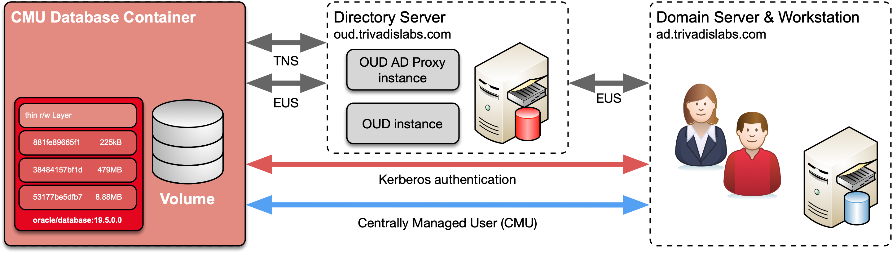
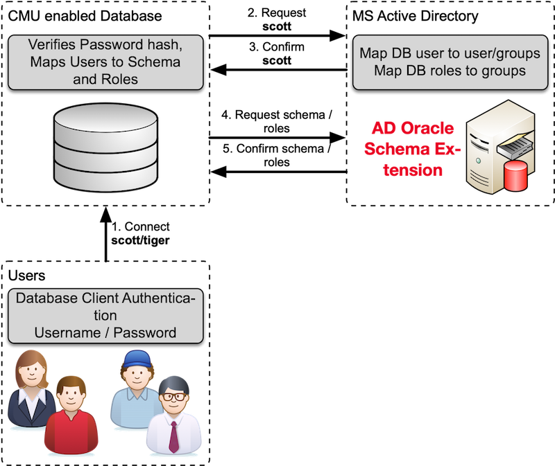

# Oracle Centrally Managed User 18c/19c

## Demo and Engineering Environment

The demo and test environment for Oracle Centrally Managed User 18c/19c described here is based on Oracle database in Docker containers and a Windows Active Directory Server running on a virtual box. The Docker images are build according to the build script in the GitHub repository [oehrlis/docker](https://github.com/oehrlis/docker). With a few adjustments the scripts can be run in any Oracle database. If you follow the Docker-based approach, the following basic images are recommended:

- Oracle Database 19c Release Update October 2019 (19.5.0.0)

The Windows Active Directory Server VM is part of the Trivadis LAB environment and available in GitHub repository [oehrlis/docker](https://github.com/oehrlis/docker). The following figure schematically illustrates the engineering and demo environment used during this presentation.



Most important login information at a glance:

- Oracle 19c Database Docker Container
  - **Host Name :** cmudb
  - **Interne IP Adresse :** depending on Docker
- Active Directory Server (Windows VM)
  - **Host Name :** win2016ad.trivadislabs.com
  - **Host Alias:** ad.trivadislabs.com
  - **Interne IP Adresse :** 10.0.0.4
- Users and passwords
  - root / gemäss Referent oder SSH Key
  - oracle / gemäss Referent oder SSH Key
  - sys / manager
  - system / manager
  - TRIVADISLABS\\Administrator / LAB01schulung
  - Allgemein AD User ist Nachname/LAB01schulung

More Information about Trivadis LAB is available available on [oehrlis/trivadislabs.com]([www.oradba.ch](https://github.com/oehrlis/trivadislabs.com)).

## Oracle Centrally Managed User at a glance

New security feature introduced with Oracle Database release 18c. Centrally Managed User (CMU) does simplify central management of database users and roles by a couple of improvements.

- CMU does not require an additional Oracle directory.
- CMU enables the administration of users directly in MS Active Directory.
- No additional license required.
- Only supported by Oracle Enterprise or Express Edition.
- Not support available / planned for Oracle Standard Edition

Oracle Centrally Managed Users does supports common authentication methods like Password- , Kerberos- und PKI / SSL authentication. Although password authentication requires a password filter and an AD schema extension. This is usually the most difficult part of configuring CMU. CMU is perfect for small and medium-sized businesses. The figure below schematically illustrates Oracle Centrally Managed Users.



## Setup the Lab Environment

The following procedure does explain the setup of the LAB environment using the vagrant for the Windows Active Airectory server and Docker for the CMD database server. It is also possible to setup the environement manually using an existing Active Directory server and Oracle database. In this case you just have to pick the relevant scripts.

### Windows Active Directory VM (win2016ad)

To setup the Windows Active Directory server you have to clone the GitHup repository [oehrlis/trivadislabs.com]([www.oradba.ch](https://github.com/oehrlis/trivadislabs.com)).

```bash
git clone https://github.com/oehrlis/trivadislabs.com.git
```

Change to the corresponding directory for the Windows VM (win2016ad).

```bash
cd trivadislabs.com/win2016ad
```

When initiating `vagrant up` vagrant will start to download the base VM image *StefanScherer/windows_2016* from the vagrant cloud. The box is about 8GB. Download will take its time. As soon as the image has been downloaded vagrant will start to provision the VM.

```bash
vagrant up
```

As soon as the provisioning is finished you can access the VM using rdp.

```bash
vagrant rdp
```

Details about the provisioning and the different setup scripts is available in the [README.md]([www.oradba.ch](https://github.com/oehrlis/trivadislabs.com/README.md)).

### Oracle Database Container (cmudb)

To build the base Docker images follow the documentation in [oehrlis/docker](https://github.com/oehrlis/docker/tree/master/OracleDatabase). 

## Test Centrally Managed Users

