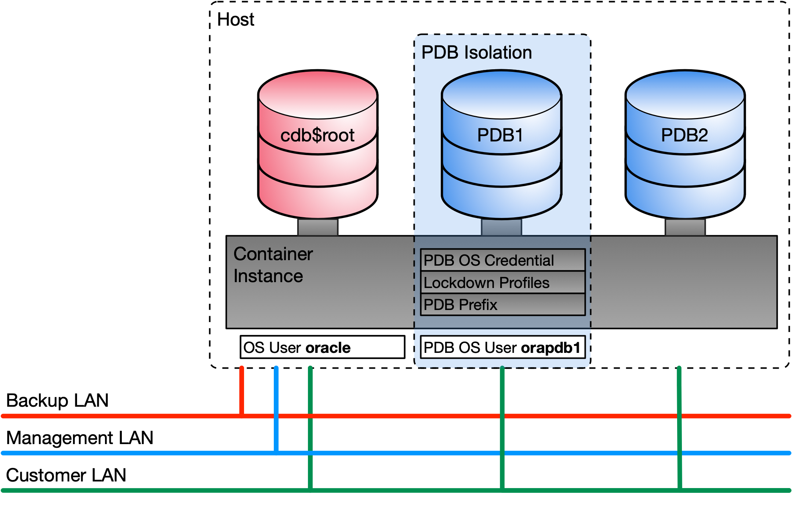

# PDB Isolation and Security

## Demo and Engineering Environment

The demo and test environment for PDB isolation and security described here is based on Oracle database in Docker containers. The Docker images are build according to the build script in the GitHub repository [oehrlis/docker](https://github.com/oehrlis/docker). With a few adjustments the scripts can be run in any Oracle container database. If you follow the Docker-based approach, the following basic images are required:

- Oracle Database 12 Release 2 RU April 2019
- Oracle Database 19c Release Update October 2019 (19.5.0.0)

To build the base Docker images follow the documentation in [oehrlis/docker](https://github.com/oehrlis/docker/tree/master/OracleDatabase). More Information about PDB Isolation and Security is available on [www.oradba.ch](www.oradba.ch)

## PDB Isolation and Security at a glance

In principle, the owner of each PDB has DBA privileges or equivalent privileges on his PDB. Various measures are taken to ensure security and separation from the operating system and other PDBs. This includes the following measures:

- Provide *DBA* role respectively customized *DBA* role to *PDB_ADMIN*
- Managing OS Access using *PDB_OS_CREDENTIAL*.
- Manage File Access using PDB *PATH_PREFIX* and *CREATE_FILE_DEST*.
- Restrict user operation in PDBs in a multitenant container database using *lockdown profiles*.

The following figure shows a diagram of the container database and security measures.



Basis for the PDB isolation is the Oracle White Paper [Isolation in Oracle Multitenant Database 12c Release 2](https://www.oracle.com/technetwork/database/multitenant/learn-more/isolation-wp-12c-3614475.pdf).

## Prepare the Demo Environment (Docker)

### General Preparation

Summary of the steps to build the Docker Engineering environment:

- Adjust the `docker-compose.yml` to match your base Docker images and Docker volumes.
- Run `docker-compose` to create the Docker containers.

    ```bash
    docker-compose up -d
    ```

- Monitor the progress of the database creation

    ```bash
    docker-compose logs -f
    ```
- As soon as you the the following message your database is ready to use.

    ```bash
    tvd122    | ---------------------------------------------------------------
    tvd122    |  - DATABASE TTVD122 IS READY TO USE!
    tvd122    | ---------------------------------------------------------------
    ...
    tvd190    | ---------------------------------------------------------------
    tvd190    |  - DATABASE TTVD190 IS READY TO USE!
    tvd190    | ---------------------------------------------------------------
    ```

- Test which PDB OS credential require some OS user. To create these user log into either of the container as root and run `01_add_pdb_os_user.sh`.

    ```bash
    docker exec -it -u root tvd190 bash --login
    bash-4.2# /u01/config/scripts/01_add_pdb_os_user.sh 
    Found passwd utility
    Skip, group orapdb exists.
    Skip, user orapdb exists.
    Changing password for user orapdb.
    passwd: all authentication tokens updated successfully.
    Add PDB OS user orapdbsec:
    Changing password for user orapdbsec.
    passwd: all authentication tokens updated successfully.
    Add PDB OS user orapdb1:
    Changing password for user orapdb1.
    passwd: all authentication tokens updated successfully.
    Add PDB OS user orapdb2:
    Changing password for user orapdb2.
    passwd: all authentication tokens updated successfully.
    Add PDB OS user orapdb3:
    Changing password for user orapdb3.
    passwd: all authentication tokens updated successfully.
    ```

### Preparation for PDB_OS_CREDENTIAL Bugfix

- For Oracle 12.2 there is to possibility to install a patch for PDB_OS_CREDENTIAL. To do this you must first download the Patch [25820082](https://updates.oracle.com/ARULink/PatchDetails/process_form?patch_num=25820082) and apply it on the database. At the time of writing this document, the patch is only available for 12.2 respectively the patch for 19c does not work.
- Login to the Docker Container as user oracle.
  
    ```bash
    docker exec -it -u oracle tvd122 bash --login
    ```

- Shutdown the database

    ```bash
    sqlplus / as sysdba <<EOF
    shutdown immediate;
    EOF
    ```

- unzip and install the patch

    ```bash
    cd /u01/config/software
    unzip p25820082_12201190416DBAPR2019RU_Linux-x86-64.zip \
        -d /u01/config/software
    cd /u01/config/software/25820082
    $cdh/OPatch/opatch apply
    ```

- Startup the database and run datapatch.

    ```bash
sqlplus / as sysdba <<EOF
startup;
EOF

$cdh/OPatch/datapatch -verbose
    ```

## Run Demo Scripts

Most of the demo script could run in any sequence, except the [10_create_pdb.sql](config/scripts/10_create_pdb.sql). Since the PDB has to be created before the tests.

Preparation scripts:

- [00_prepare_pdb_env.sh](config/scripts/00_prepare_pdb_env.sh) Script to add a tnsname entry and other stuff for the PDB PDBSEC.
- [01_add_pdb_os_user.sh](config/scripts/01_add_pdb_os_user.sh) Script to add a PDB OS user. Has to be run as root
- [10_create_pdb.sql](config/scripts/10_create_pdb.sql) Create a PDB (pdbsec) used for PDB security engineering.

Multitenant file access scripts:

- [20_create_directories.sql](config/scripts/20_create_directories.sql) Script to create directories.
- [30_create_datafile.sql](config/scripts/30_create_datafile.sql) Script to create datafiles.

Multitenant OS access scripts:

- [40_create_PDB_OS_CREDENTIAL.sql](config/scripts/40_create_PDB_OS_CREDENTIAL.sql) Script to configure PDB_OS_CREDENTIAL.
- [41_create_ext_table.sql](config/scripts/41_create_ext_table.sql) Script to configure table pre-processors.
- [42_create_scheduler_job.sql](config/scripts/42_create_scheduler_job.sql) Script to configure external OS jobs.

Lockdown profile scripts:

- [50_create_lockdown_profiles_12.2.sql](config/scripts/50_create_lockdown_profiles_12.2.sql) Script to create lockdown profiles for 12.2.
- [50_create_lockdown_profiles.sql](config/scripts/50_create_lockdown_profiles.sql) Script to create lockdown profiles.
- [51_lockdown_trace_view.sql](config/scripts/51_lockdown_trace_view.sql) Script to create lockdown profiles for trace files.
- [53_lockdown_external_table.sql](config/scripts/53_lockdown_external_table.sql) Script to create lockdown profiles external table.

Miscellaneous and clean up scripts:

- [60_dbms_sys_sql_test.sql](config/scripts/60_dbms_sys_sql_test.sql) Script to verify DBMS_SYS_SQL
- [90_drop_pdb.sql](config/scripts/90_drop_pdb.sql) Drop PDB (pdbsec) used for PDB security engineering
- [ld_profiles.sql](config/scripts/ld_profiles.sql) Displays information about lockdown profiles.
- [ld_rules.sql](config/scripts/ld_rules.sql) Displays information about lockdown rules in the current container.
- [lpdb.sql](config/scripts/lpdb.sql) List PDBS.

## Run Demo Scripts on other environments

If you run the demo script on any other environment you do have to consider the following:

- Run the prepare environment script `00_prepare_pdb_env.sh` to create directories and listener entries
- Run as root the script `01_add_pdb_os_user.sh` to create OS user. Alternatively create users manually.
- Adjust the SQL scripts and set the correct path for you PATH_PREFIX etc.
